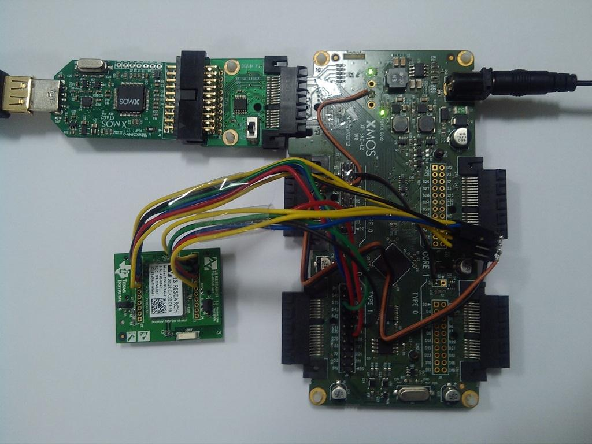

.. _tiwisl_simple_webserver_Quickstart:

TiWi-SL Simple Web Server Demo Quickstart Guide
===============================================

sc_wifi demo : Quick Start Guide
--------------------------------

This simple demonstration of xTIMEcomposer Studio functionality uses 
the ``Wi-Fi`` Slice Card together with the xSOFTip ``module_wifi_tiwisl`` 
to demonstrate how the module is used to:

   * connect to a wireless access point, 
   * Run a very simple HTTP server to display a "Hello World!" webpage.

Hardware Setup
++++++++++++++

The XP-SKC-L2 Slicekit Core board has four slots with edge connectors: ``SQUARE``, ``CIRCLE``, ``TRIANGLE`` and ``STAR``. 

To setup up the system:

   #. Connect ``Wi-Fi`` Slice Card to the XP-SKC-L2 Slicekit Core board using the connector marked with the ``TRIANGLE``.
   #. Connect the XTAG Adapter to Slicekit Core board, and connect XTAG-2 to the Adapter. 
   #. Connect the XTAG-2 to host PC. Note that the USB cable is not provided with the Slicekit starter kit.
   #. Set the ``XMOS LINK`` to ``ON`` on the XTAG Adapter.
   #. Ensure the wireless access point is switched on and configured.
   #. Switch on the power supply to the Slicekit Core board.

   Hardware Setup for TiWi-SL Simple Web Server Demo
   
	
Import and Build the Application
++++++++++++++++++++++++++++++++

   #. Open xTIMEcomposer and check that it is operating in online mode. Open the edit perspective (Window->Open Perspective->XMOS Edit).
   #. Locate the ``'app_tiwisl_simple_webserver'`` item in the xSOFTip pane on the bottom left of the window and drag it into the Project Explorer window in the xTIMEcomposer. This will also cause the modules on which this application depends (in this case, module_wifi_tiwisl and module_spi_master) to be imported as well. 
   #. Click on the ``app_tiwisl_simple_webserver`` item in the Project Explorer pane then click on the build icon (hammer) in xTIMEcomposer. Check the console window to verify that the application has built successfully.

For help in using xTIMEcomposer, try the xTIMEcomposer tutorial, which you can 
find by selecting Help->Tutorials from the xTIMEcomposer menu.

Note that the Developer Column in the xTIMEcomposer on the right hand side of 
your screen provides information on the xSOFTip components you are using. 
Select the module_wifi_tiwisl component in the Project Explorer, and you will 
see its description together with API documentation. Having done this, click 
the `back` icon until you return to this quickstart guide within the Developer 
Column.

Run the Application
+++++++++++++++++++

Now that the application has been compiled, the next step is to run it on the 
Slicekit Core Board using the tools to load the application over JTAG (via 
the XTAG2 and Xtag Adapter card) into the xCORE multicore microcontroller.

   #. Select the file ``main.xc`` in the ``app_tiwisl_simple_webserver`` project from the Project Explorer.
   #. Click on the ``Run`` icon (the white arrow in the green circle). 
   #. At the ``Select Device`` dialog select ``XMOS XTAG-2 connect to L1[0..1]`` and click ``OK``.
   #. xTIMEcomposer console displays the IP address obtained by the DHCP client. Sample message on the console::
        
        **WELCOME TO THE SIMPLE WEBSERVER DEMO**
        IP Address: 192.168.1.100

   #. From a PC connected to the same network, open a web browser and
      open the link::

        http://192.168.1.100
        
      using the IP adress printed out by the application. This should
      display a "Hello World!" webpage. You have now got the Wi-Fi slice up and 
      running.

.. figure:: images/hello_world.png
   :align: center

   Hello World! web page
    
Next Steps
++++++++++

  #. Examine the application code. In xTIMEcomposer navigate to the ``src`` directory under app_tiwisl_simple_webserver and double click on the ``xhttpd.xc`` file within it. The file will open in the central editor window.
  #. Trying changing the ``ap_config`` variables on line 41. Members of this structure are: SSID, Key and Security type. Change this to connect to a different access point.

Try the GPIO Wi-Fi combo Demo
.............................

This example demonstrates the use of two Slice Cards, XA-SK-GPIO and Wi-Fi slice together with the xSOFTip components for Wi-Fi, SPI, I2C and WebServer to provide access to the GPIO slice features via a simple embedded webserver.

A webpage served from the sliceKIT and accessed in a browser on a host PC has the following demo functions:
   * Turn GPIO Slice Card LEDS on and off
   * Read the room temperature via the on-board ADC and display on the web page
   * Display GPIO Slice Card button press status

Once you have both the XA-SK-GPIO and Wi-Fi slices you can try the GPIO Wi-Fi combo demo by :ref:`_Slicekit_GPIO_Wifi_Tiwisl_Demo_Quickstart` 
